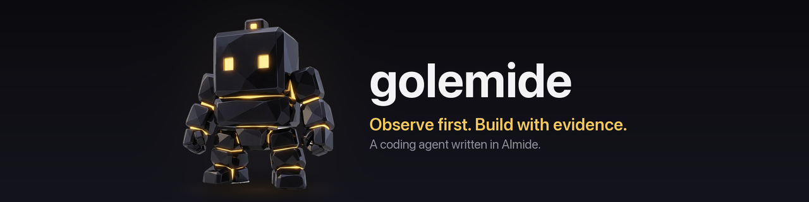

<p align="center">
  
</p>

<p align="center">Read the project. Make the edit. Run the tests.</p>
<p align="center">
  <a href="https://github.com/O6lvl4/golemide/actions/workflows/quality.yml"></a>
  · <a href="README_ja.md">日本語</a>
  · <a href="#quick-start">Quick start</a>
  · <a href="docs/quality-plan.md">Quality plan</a>
</p>

golemide works from the evidence in your repository: source files, project markers,
compiler diagnostics and test results. It selects relevant files, proposes edits,
checks their syntax with available tools, and runs your verification command again.

Built with [Almide](https://github.com/almide/almide), golemide runs as a single native
binary. Optional companion tools add syntax trees, structured reads and compact
failure summaries.

## Quick start

With Almide installed, build from this repository:

```sh
almide build
./golemide observe --root ../project
```

`observe` inspects the project and runs its verification command without asking a
model. To make edits, set `CLOUDFLARE_ACCOUNT_ID` and `CLOUDFLARE_API_TOKEN` in
`~/.config/golemide/.env`, the target project's `.env`, or the environment, then give
golemide a task:

```sh
./golemide solve "fix clamp for out-of-range values" \
  --root ../project --verify "cargo test" --attempts 6
```

Choose `--verify` for your project: its exit status decides success. Use
`./golemide help` for options, or `./golemide llm-test` to check credentials with one model
call.

### Models

golemide runs on `cf:glm-5.3-flash` and escalates to `cf:glm-5.3` after repeated
failures. `--model` and `--strong-model` choose others, as `PROVIDER:MODEL`:

| Model | Runs on | Needs |
|---|---|---|
| `cf:glm-5.3-flash` (default), `cf:glm-5.3`, … | Cloudflare Workers AI | `CLOUDFLARE_ACCOUNT_ID`, `CLOUDFLARE_API_TOKEN` |
| `openai:…`, `openrouter:…`, `deepseek:…`, `zai:…`, `groq:…` | that OpenAI-compatible service | `OPENAI_API_KEY`, `OPENROUTER_API_KEY`, … |
| `anthropic:…`, `gemini:…` | Anthropic's Messages API, Gemini | `ANTHROPIC_API_KEY`; `GEMINI_API_KEY` or `GOOGLE_API_KEY` |
| `ollama:…`, `lmstudio:…` | a local server | nothing |
| `NAME:MODEL` | any other OpenAI-compatible service | `NAME_BASE_URL`, `NAME_API_KEY` |
| `claude`, `claude:sonnet`, … | Claude Code's `claude -p`, on your Claude login | `claude` on `PATH` |

```sh
./golemide solve "fix clamp" --root ../project --verify "cargo test" \
  --model claude:sonnet --strong-model claude:opus
```

Cloudflare's credentials are needed only for a `cf:` model. Cost is Cloudflare's meter,
a service's own reported cost (OpenRouter), or, for `claude`, what `claude -p` reports;
for other services it is not known and counts as zero. `claude -p` runs with its tools,
settings, hooks and MCP servers off, but still reads your global `CLAUDE.md` and memory.

`golemide polish` asks for the same behaviour written more simply, on a project
whose verification command already passes. A polish that stops it passing is
rolled back to the version that did.

```sh
./golemide polish --root ../project --verify "cargo test"
```

### Called by another agent

[comide](https://github.com/O6lvl4/comide), a coding agent in the
terminal, calls golemide this way for every edit and `solve`. It needs golemide 0.2.0 or
later (`golemide --version`) and reads the same `~/.config/golemide/.env`.

`solve --json` and `polish --json` print one JSON object on stdout in place of the report.
It carries the status, exit code, cost, each attempt, the diff of the whole run and the
tail of the last verify output. Progress stays on stderr. Without a verify command, `solve` writes one attempt
and stops with exit 4, because nothing could check a second.

`golemide edit` applies an edit the caller has already decided on. The edit goes
through the same path, replacement and syntax checks as the edits `solve` asks the model for:

```sh
echo '{"path": "src/lib.rs", "replacements": [{"old": "a + b", "new": "a - b"}]}' \
  | ./golemide edit --root ../project
# {"ok":true,"path":"src/lib.rs","bytes":812,"checked_by":"gramide","matched":[],"diff":"…"}
```

It exits 0 when the file was written, 1 when the edit was refused with a reason, and
2 when the input was not an edit.

## From observation to a verified edit

1. **Observe.** Inspect the project, list its files, build a repository map when
   available, and collect the current verification output.
2. **Read.** Select relevant files. Small projects can be read without a model call
   for file selection.
3. **Edit.** Ask for complete files and check each edit with the configured or
   available syntax checker before writing it.
4. **Verify.** Run the verification command again. Feed the result, actual diff and
   rejected edits into the next attempt if more work is needed.

Compiler explanations help make diagnostics actionable. Repeated failures prompt
a different approach; unusable responses can trigger more reasoning or a stronger
model.

## Small tools, working together

| Tool | What it adds to golemide |
|---|---|
| [gramide](https://github.com/O6lvl4/gramide) | Syntax checks for Almide, Go and Rust, plus ranked repository maps |
| [hew](https://github.com/O6lvl4/hew) | Lossless bounded source reads and parser-backed symbol outlines |
| [ctxgate](https://github.com/O6lvl4/ctxgate) | Compact summaries of long verification failures |

Install companions separately and put them on `PATH`. golemide uses them when
available, with built-in fallbacks when they are absent.

## The language reference

A model writing in a language it has never seen guesses, and the guesses are the
expensive part: on this project's own measurements every failed attempt was a
compile error, never a wrong answer. So golemide shows it a reference, found in
this order and named in the output:

| Tier | Where |
|---|---|
| 1 | `CAIRN_REFERENCE_<LANGUAGE>=/path/to/notes.md` (`=off` asks for none) |
| 2 | a reference the project carries — `CHEATSHEET.md`, `docs/CHEATSHEET.md` |
| 3 | one the toolchain prints — `almide ide stdlib-snapshot` for Almide |

Tier 3 needs no configuration. A language with no reference gets none, and the
run says so rather than pretending otherwise. References longer than 48 KB are
clipped, and the label says they were.

## Slow requests

One request may be hedged: if the first has not answered within
`CAIRN_HEDGE_MS` (default 120000), a second identical one is started and the
first answer to arrive is used. The run reports how many were hedged and how
many the hedge actually won, because a hedge that never wins is a second
request paid for and discarded.

`CAIRN_CALL_MAX_MS` (default 360000) is the wall-clock cap on one request. It
exists because the idle deadline cannot catch the failure that costs the most:
a model that keeps talking is never idle. One observed call streamed 1.7 MB
over twelve minutes before it was stopped by hand. Past the cap the request is
abandoned and the next attempt is asked for less.

## Syntax checks before writing

`CAIRN_CHECK_<EXT>` overrides the checker for an extension. Otherwise, golemide uses:

| Language | Check |
|---|---|
| Almide, Go | gramide, falling back to `almide check` / `gofmt -e` |
| Rust | gramide, falling back to `rustfmt --edition 2024 --emit stdout` |
| Python, Ruby, JavaScript, PHP, Lua, shell, JSON, TOML | Language-specific tools |
| Java, C++, C, C#, Kotlin, Scala, Swift, TypeScript | `gramide balance` for delimiters and literals |

Coverage depends on the available checker. Delimiter balance is a limited check,
and syntax acceptance does not establish that a program is correct. Unavailable
checks are reported; the project's verification command remains the final test.

## Progress, measured

The repository's historical Almide exercise run reported **23/23 solved for $0.19**,
using `cf:glm-5.3-flash`, a language cheatsheet and up to six attempts per task.
This is a small development benchmark, not a general repair-success rate or a
world ranking. Model training exposure is unknown.

The [quality plan](docs/quality-plan.md) defines the next comparisons: independently
verified repairs, total cost and time, syntax accuracy, and source-reading
precision. The [benchmark harness](bench/almide.sh) can be checked without model
calls using `BENCH_CHECK_ONLY=1`; [the polyglot harness](bench/exercism.sh) provides
another comparison path.

## Development

```sh
almide test
bash ci/check.sh       # tests, build and CLI smoke; no model calls
```

CI pins the compiler and Rust versions. See [reproducible checks](ci/README.md).

| Source | Responsibility |
|---|---|
| `src/main.almd` | Commands, options and credentials |
| `src/observe.almd` | Project inspection and verification commands |
| `src/solve.almd` | File selection and the edit/verify loop |
| `src/replace.almd` | Finding the text a replacement names, exactly or by a fixed ladder of loosenings |
| `src/report.almd` | The final report, for a person or as JSON |
| `src/tool.almd` | `golemide edit`: one caller-decided edit through the write checks |
| `src/gate.almd` | Syntax checks before writes |
| `src/reference.almd` | The language reference shown to the model |
| `src/explain.almd` | Compiler diagnostic explanations |
| `src/ask.almd` | Structured model requests and retries |
| `src/llm.almd` | Workers AI streaming and cost accounting |

## License

[MIT](LICENSE-MIT) or [Apache-2.0](LICENSE-APACHE), at your option.

Reads expand from 24,000 to at most 96,000 Unicode characters when needed. Files
still truncated remain read-only context; golemide will not replace them wholesale.

Golemide discovers grammar-backed checks from `gramide languages` packages with the
`check` capability. Reader-only packages do not qualify as syntax gates. Explicit
project overrides retain precedence; existing fallback checkers remain available.
